# HDFS Lab 2 - Administration Report

Course: Big Data Systems
Lab: HDFS File System Administration

## Abstract

This report documents the deployment of a mini HDFS + YARN cluster with Docker, and a sequence of administrative tasks: permissions, ACLs, snapshots, quotas, replication, integrity checks, monitoring, and alerting. Evidence is provided as screenshots.

## Environment

- Platform: Docker-based mini cluster
- Services: NameNode, DataNode, ResourceManager, NodeManager
- Monitoring: Prometheus + Grafana

## Objectives

- Validate cluster health through CLI and web interfaces.
- Apply HDFS administration features: ACLs, snapshots, quotas, replication, and integrity checks.
- Observe metrics and alerts with Prometheus and Grafana.

## Methodology

Commands were executed inside the NameNode container. UI validation used the NameNode and ResourceManager web interfaces. Monitoring was configured via JMX Exporter, scraped by Prometheus, and visualized in Grafana. Alerts were validated by simulating a DataNode failure.

## Results and Evidence

### 1. Cluster Startup

Procedure:

```bash
docker compose up -d
docker compose ps
```

Evidence:

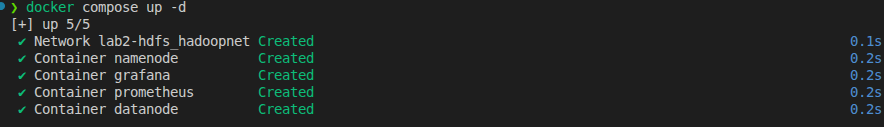

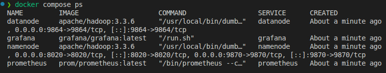

### 2. Web UI Validation

Checks:

- NameNode UI: http://localhost:9870
- ResourceManager UI: http://localhost:8088

Evidence:

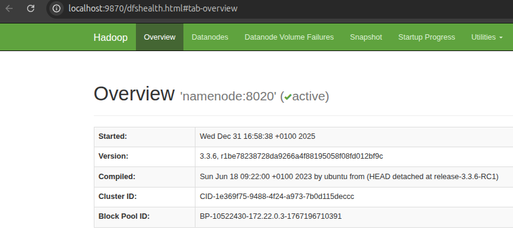

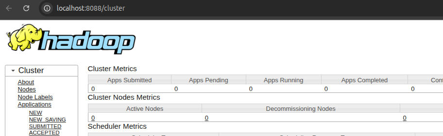

### 3. Admin Shell Access

Procedure:

```bash
docker exec -it namenode bash
# Then inside the container:
hdfs dfs -ls /
hdfs dfsadmin -report
```

Evidence:

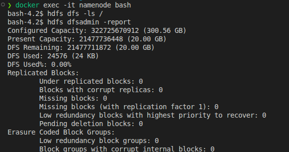

### 4. HDFS Layout and Permissions

Procedure:

```bash
hdfs dfs -mkdir -p /cours/tp1
hdfs dfs -mkdir -p /user/student1 /user/student2
hdfs dfs -chmod 755 /user /cours
hdfs dfs -chmod 700 /user/student1 /user/student2
```

Dataset creation:

```bash
cat > /tmp/sales.csv << 'EOF'
id_client,date,total
101,2025-09-01,120.50
102,2025-09-01,45.00
101,2025-09-02,33.20
103,2025-09-02,250.00
EOF

hdfs dfs -put -f /tmp/sales.csv /cours/tp1/
hdfs dfs -ls -h /cours/tp1
```

Evidence:

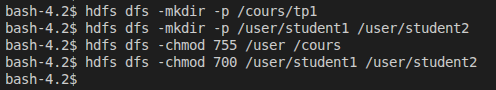

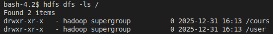

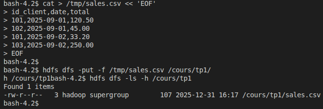

### 5. Access Control Lists (ACLs)

Procedure:

```bash
hdfs dfs -getfacl /cours/tp1
hdfs dfs -setfacl -m user:student2:r-x /cours/tp1
hdfs dfs -getfacl /cours/tp1
```

Evidence:

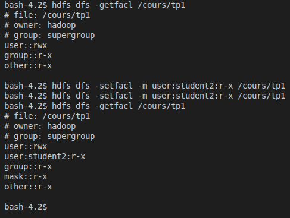

### 6. Snapshots

Procedure:

```bash
hdfs dfsadmin -allowSnapshot /cours
SNAP="pre_modif_$(date +%Y%m%d_%H%M%S)"
hdfs dfs -createSnapshot /cours "$SNAP"
hdfs dfs -ls /cours/.snapshot
```

Restore test:

```bash
hdfs dfs -rm /cours/tp1/sales.csv
hdfs dfs -ls /cours/tp1

hdfs dfs -cp /cours/.snapshot/$SNAP/tp1/sales.csv /cours/tp1/
hdfs dfs -ls /cours/tp1
```

Evidence:

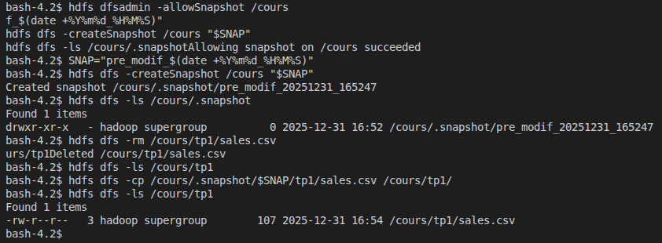

### 7. Quotas

Procedure:

```bash
hdfs dfsadmin -setSpaceQuota 1m /user/student1
hdfs dfsadmin -setQuota 100 /user/student1
hdfs dfs -count -q -h /user/student1
```

Quota test:

```bash
dd if=/dev/zero of=/tmp/bigfile.bin bs=64K count=40 # ~2.5 MB
hdfs dfs -put /tmp/bigfile.bin /user/student1/ || echo "Expected failure (quota exceeded)"
```

Reset:

```bash
hdfs dfsadmin -clrSpaceQuota /user/student1
hdfs dfsadmin -clrQuota /user/student1
```

Evidence:

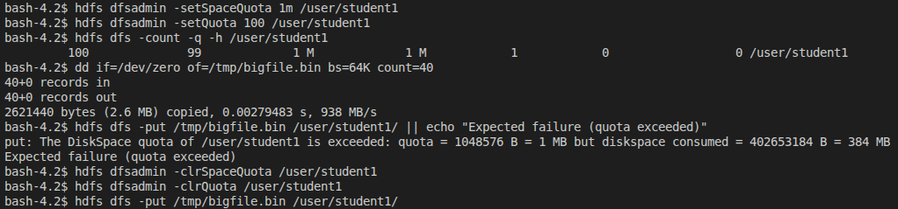

### 8. Replication and Integrity

Procedure:

```bash
hdfs getconf -confKey dfs.replication || true
hdfs dfs -stat %r /cours/tp1/sales.csv
```

```bash
hdfs dfs -setrep 2 /cours/tp1/sales.csv
hdfs dfs -stat %r /cours/tp1/sales.csv
hdfs balancer -threshold 10
```

```bash
hdfs fsck / -files -blocks -locations | head -n 50
```

Evidence:

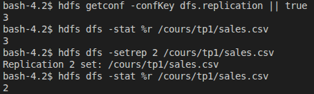

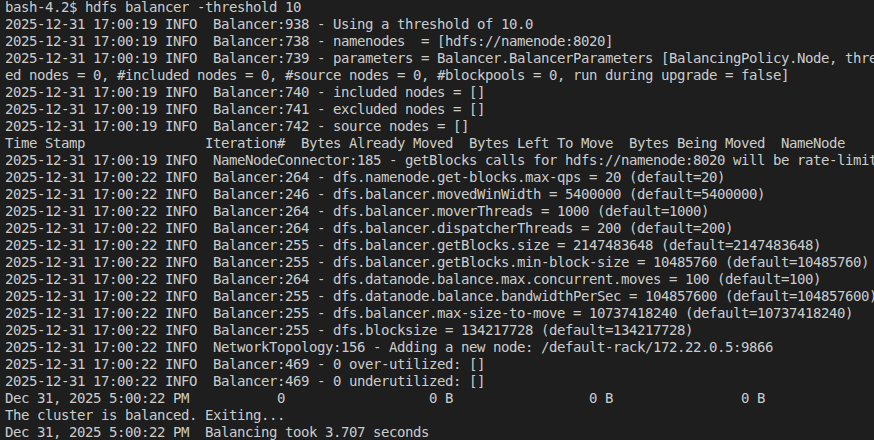

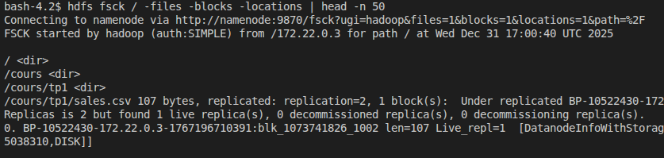

### 9. Safemode

Procedure:

```bash
hdfs dfsadmin -safemode get
```

Evidence:

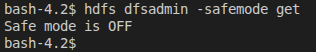

### 10. Monitoring (Prometheus + Grafana)

Architecture:

```
NameNode (JMX) -> Prometheus -> Grafana
DataNode (JMX)  -----------^
```

JMX configuration file:

- `monitoring/jmx/hadoop.yml`

Evidence:

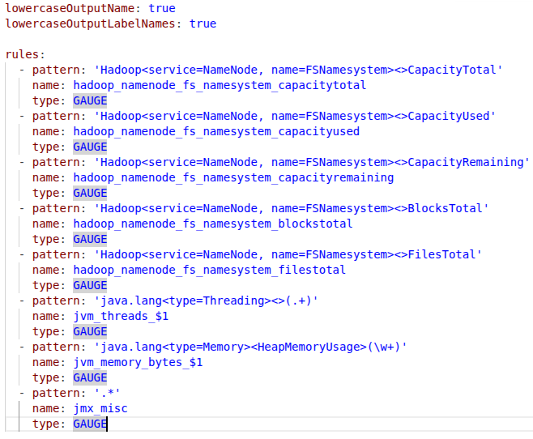

Launch monitoring:

```bash
docker compose up -d
```

Evidence:

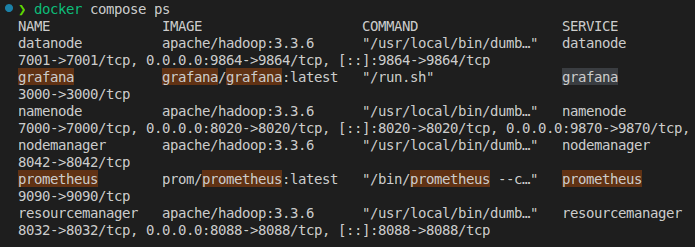

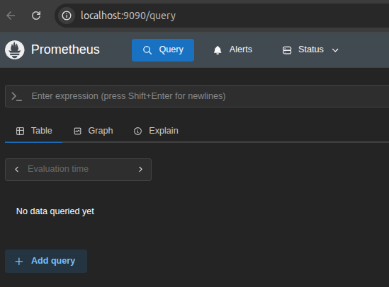

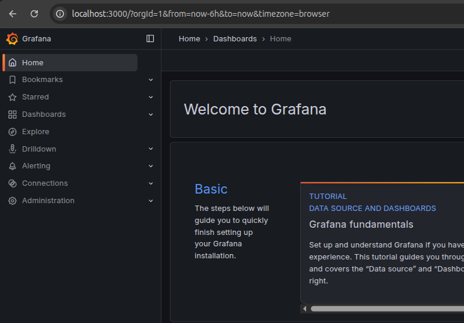

Dashboard import:

- File: `monitoring/jmx/hdfs_dashboard.json`
- Metrics: capacity, blocks, files, JVM heap, threads

Evidence:

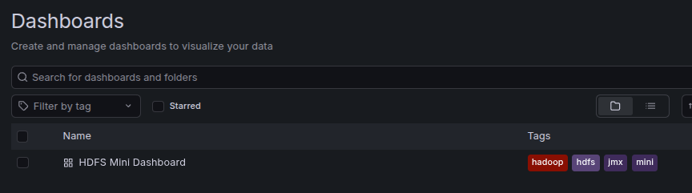

Experimentation:

```bash
hdfs dfs -mkdir /test
hdfs dfs -put /etc/passwd /test/
hdfs dfs -put /etc/hosts /test/
```

Evidence:

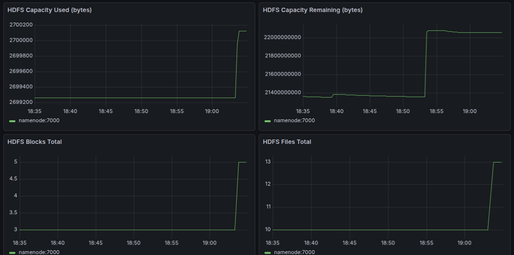

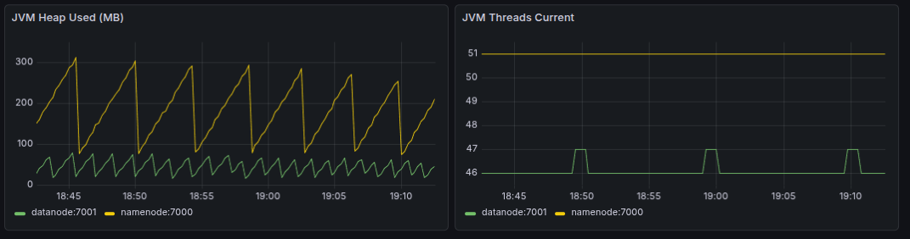

### 11. Alerting

Alert locations:

- Prometheus: http://localhost:9090/alerts
- Alertmanager: http://localhost:9093

Evidence:

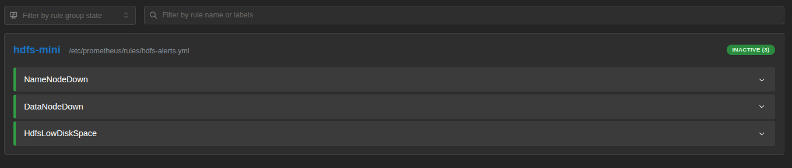

Failure simulation:

```bash
docker stop datanode
```

Evidence:

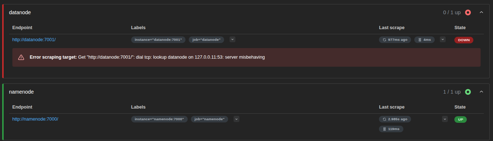

Alert fired after ~30 seconds.

Evidence:

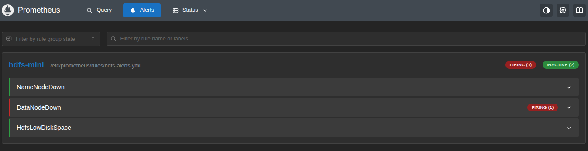

Recovery:

```bash
docker start datanode
```

Evidence:


## Conclusion

The cluster was successfully deployed and validated. HDFS administration tasks (permissions, ACLs, snapshots, quotas, replication, and integrity) were executed with expected behavior. Monitoring and alerting workflows were verified using Prometheus and Grafana, including a simulated DataNode failure.
